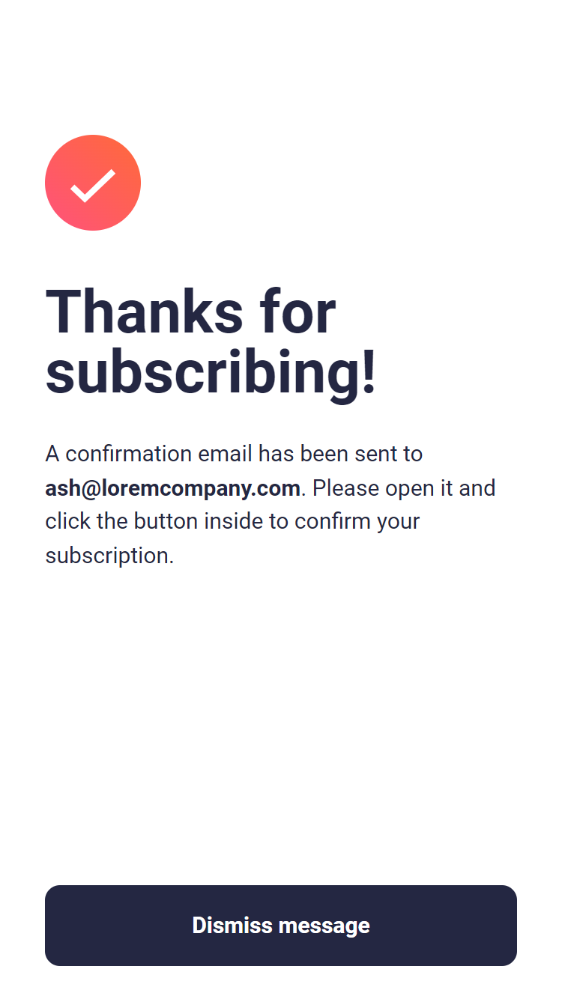
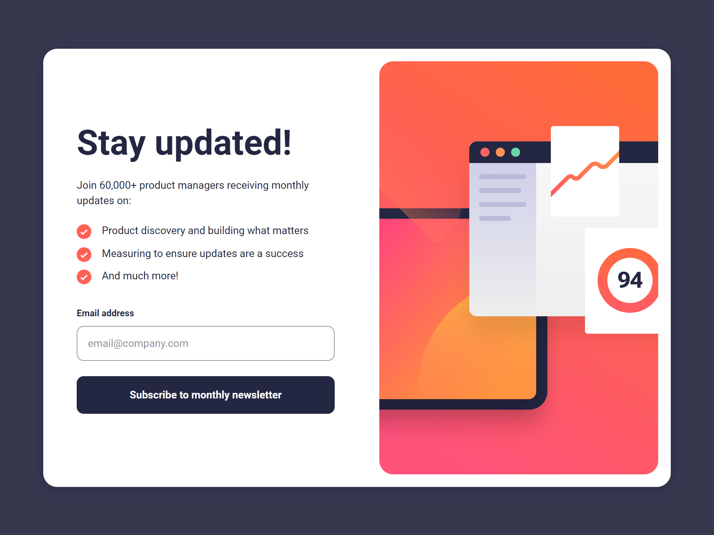
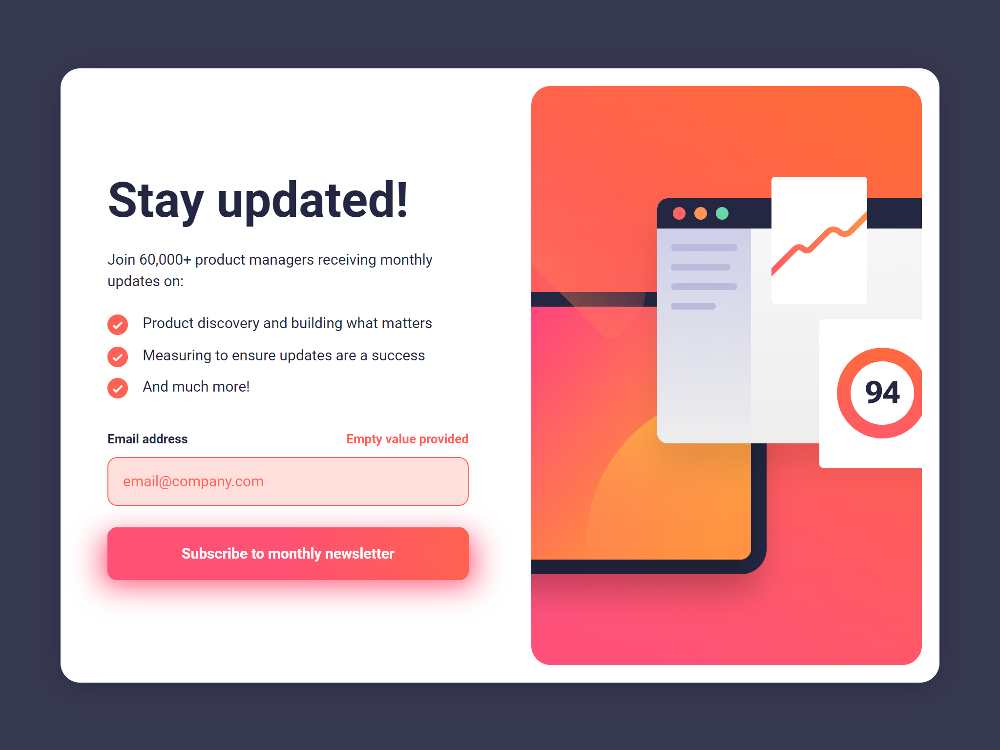

# Frontend Mentor - Newsletter sign-up form with success message solution

Hi there!

Firstly, thank you for taking your time to review my project.

This is a solution to the [Newsletter sign-up form with success message challenge on Frontend Mentor](https://www.frontendmentor.io/challenges/newsletter-signup-form-with-success-message-3FC1AZbNrv).

## Table of contents

- [Overview](#overview)
- [Screenshots](#screenshot)
- [Built with](#built-with)
  

**Note: Delete this note and update the table of contents based on what sections you keep.**

## Overview

This is a simple project which allows users to type in their email address to sign up for a newsletter.

Summary:
- Upon submit, the form is checked by a custom hook which vefifies value provided in the input.
- If an email is successfully submitted, it's saved within the Local Storage.
- Users will receive an appropriate error message in the following scenarios: 
  - The input is empty.
  - Provided value is not a valid email address.
  - The email has already been provided and it's present in the Local Storage.
- The validity check is slighly delayed using a setTimeout() method which imitates sending a request to an external server and allows users to see a loading modal.
- Loading modal is rendered in a separate div using React Portal.
- Application state is managed by React Context.
- users can view the optimal layout for the interface depending on their device's screen size as well as see hover and focus states for all interactive elements on the page.

## Screenshot

Main page mobile view:

Main page mobile view - error states:

Confirmation page mobile view:

Main page desktop view:

Main page desktop view - error states:

Confirmation page desktop view:

## Built with

- Semantic HTML5 markup
- SCSS
- TypeScript
- React.js
- Mobile-first workflow